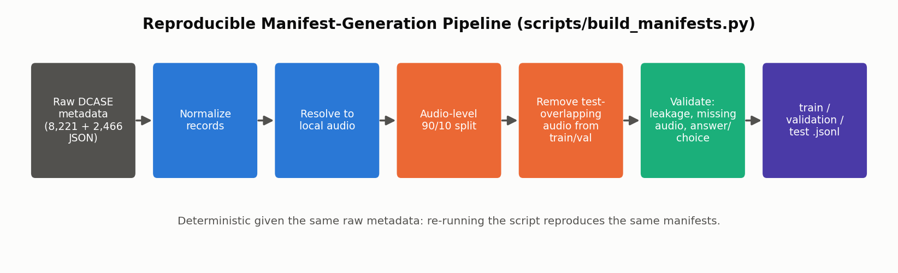
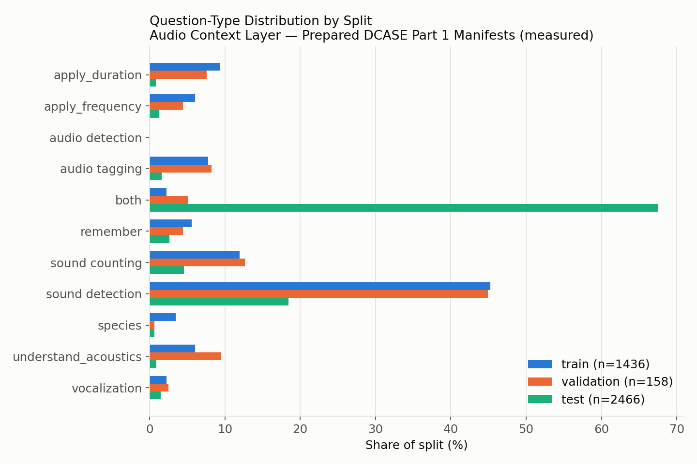
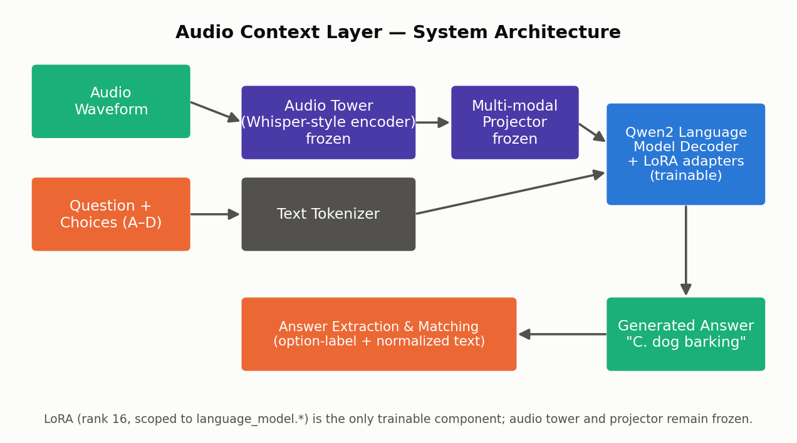
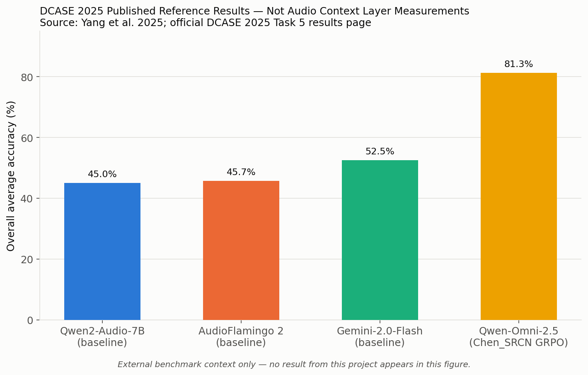

# Audio Context Layer: A Multimodal Question-Answering System Grounded in Audio Content

**A LoRA-Adapted Qwen2-Audio-7B-Instruct System for the DCASE 2025 Audio Question Answering Benchmark**

---

## Abstract / Executive Summary

The Audio Context Layer is a proof-of-concept system that answers natural-language, multiple-choice questions grounded in an audio recording. Given an audio clip and a question with answer choices, the system uses a pretrained audio-language model, adapted with parameter-efficient fine-tuning (LoRA), to produce an answer supported by the acoustic content. The project targets the DCASE 2025 Task 5 Audio Question Answering benchmark (Part 1) and Qwen2-Audio-7B-Instruct as the foundation model.

This report documents the complete system: dataset construction and validation, a reproducible data pipeline with verified audio-level train/validation/test isolation, a supervised fine-tuning methodology with a correctly masked training objective, a LoRA adaptation strategy scoped to the language-model decoder, and an evaluation methodology with conservative, auditable answer matching. All dataset, leakage, and audio-integrity figures in this report are measured directly from the prepared data and are reproducible by re-running the pipeline scripts referenced throughout (`scripts/generate_report.py` regenerates this document itself from those result files). Model accuracy, loss curves, and error analysis are populated from the same `results/` artifacts when present. Published DCASE 2025 benchmark results are presented separately, as external reference context, and are never presented as results of this project.

---

## 1. Problem Formulation

**Task.** Given an audio recording and a natural-language question with a set of candidate answers, produce the answer that is best supported by the audio's content.

**Input.** An audio waveform, a question string, and (for the DCASE Part 1 format) four multiple-choice options.

**Output.** One of the provided options, expressed as a letter and its associated text (e.g. `"C. dog barking"`).

**Grounding requirement.** The answer must be determined from the acoustic content of the clip — not from question text alone, prior knowledge, or answer-choice phrasing artifacts. This shapes every downstream design decision: audio-level data splitting, a training objective that supervises only the answer span, and an evaluation protocol that credits the correct option regardless of exact phrasing.

---

## 2. Research Study: Why This Problem, Dataset, and Model

**Why Audio Question Answering?** Most audio ML systems perform a single, narrow task (classification, tagging, captioning). Question answering is a more general interface: it lets a single system be probed for many kinds of information from the same audio, which is closer to how the capability would actually be used downstream.

**Why DCASE 2025 Task 5?** DCASE (Detection and Classification of Acoustic Scenes and Events) is a long-running, peer-reviewed benchmark series with an established audio question-answering task in its 2025 edition. Using an existing, structured benchmark rather than an ad hoc dataset gives the project a documented data format, an existing question taxonomy, and an external reference point for what published systems achieve on the same task family (Section 15).

**What question types does this dataset actually contain?** The DCASE Part 1 metadata labels each record with a `question_type` field. The types actually observed in the prepared data (Section 5) are: `sound detection`, `sound counting`, `audio tagging`, `apply_duration`, `apply_frequency`, `understand_acoustics`, `remember`, `species`, `vocalization`, `both`, and (test-only, 2 records) `audio detection`. These correspond loosely to perceptual/sound-event identification (`sound detection`, `audio tagging`, `species`, `vocalization`), counting (`sound counting`), and some acoustic-property and combined-reasoning questions (`apply_duration`, `apply_frequency`, `understand_acoustics`, `both`). **The dataset does not contain a category explicitly labeled "temporal" or "causal."** Some `both`-type questions have a causal or inferential flavor in their phrasing (e.g. asking for the *likely reason* a mood or scene sounds a certain way), but this project does not claim the dataset provides systematic coverage of temporal-ordering or causal-reasoning questions as a category, and error analysis (Section 24) does not attribute failures to "causal reasoning" beyond what a specific question's phrasing supports.

**Why Qwen2-Audio-7B-Instruct?** It is a publicly available, instruction-tuned audio-language model purpose-built for audio-grounded chat and question answering (audio encoder + LLM decoder + multimodal projector, Section 11), rather than a text LLM retrofitted with an audio front-end. It is also one of the systems for which DCASE 2025 publishes a reference baseline (Section 15), giving this project's architectural choice an external comparison point.

**Why supervised fine-tuning rather than zero-shot only?** The project brief requires an actual adaptation experiment, not only a zero-shot demonstration. Fine-tuning on the target answer format and question distribution is expected to improve both task accuracy and output-format reliability (producing the expected `"Letter. text"` format) relative to an unadapted model.

**Why LoRA?** Full fine-tuning of an ~8.4B-parameter model is not a proportionate or, on typical single-GPU hardware, even feasible approach for a proof of concept. LoRA (Hu et al., 2021) adapts a small number of injected low-rank matrices while leaving the pretrained weights frozen, which is standard practice for adapting large pretrained models on limited compute.

**Why audio-level splitting?** A question-level split can place two different questions about the *same* recording into two different partitions, letting the model see that recording's characteristics during training and then be "evaluated" on it. Splitting at the audio level guarantees that every question about a given recording stays in one partition.

**Why these evaluation metrics?** Exact-string matching would penalize correct answers stated in a different surface form than the reference (e.g. a full sentence instead of the `"Letter. text"` format). Semantic-similarity matching would risk crediting confidently-wrong answers that happen to be topically related. The evaluation protocol (Section 16) sits deliberately between these: it extracts and compares the selected option letter where possible, with a conservative, non-semantic text-normalization fallback.

---

## 3. Dataset

**Source.** DCASE 2025 Task 5, Audio Question Answering, Part 1. Raw per-record metadata (JSON, one file per question) and audio (WAV/WAV-container files) were obtained from the official challenge distribution and are treated as external source material; only project-local, derived copies are used by this repository (see Section 27, Reproducibility, for provenance).

**Raw metadata fields**, present on every record: `question`, `choice` (a list of four `"Letter. text"` options), `answer` (one of those four strings, verbatim), `id` (an audio identifier), `audio_url` (a relative reference to the corresponding audio file), `question_type`.

**Raw inventory:**

| | Train partition | Dev partition |
|---|---:|---:|
| Metadata (QA) records | 8,221 | 2,466 |
| Metadata records resolving to local audio | 1,778 | 2,466 |

Only the subset of the official train partition whose audio was locally available could be used; this is documented as a coverage limitation in Section 26, not concealed.

---

## 4. Dataset Preparation and Construction Methodology

The prepared manifests are produced by a single, reproducible script (`scripts/build_manifests.py`), not maintained by hand. Given the same raw metadata, it reproduces the same manifests.



**Pipeline steps:**

1. **Normalize** every raw metadata record into a common schema (`record_id`, `audio_id`, `audio_path`, `question`, `choices`, `answer`, `question_type`, source partition).
2. **Resolve** each record to its local audio file; drop any record whose audio is not locally present.
3. **Assign the official dev partition to `test`, unmodified** — the held-out evaluation set is the official DCASE dev partition, preserved intact wherever leakage remediation (Section 7) does not require otherwise.
4. **Split the train pool at the audio level**: unique `audio_id`s are sorted and every 10th is assigned to `validation`, the remainder to `train` (a 90/10 audio-level split).
5. **Remove any audio that also appears in `test`** from `train` and `validation` (Section 7) — `test` itself is never modified by this step.
6. **Validate**: zero missing audio references, zero duplicate record ids, zero remaining cross-split audio overlap, and an audit of answer/choice-list consistency (Section 8).
7. **Write** `train.jsonl`, `validation.jsonl`, `test.jsonl`.

---

## 5. Question Types

Measured distribution over the prepared manifests:



`sound detection` is the largest category in train/validation, while `both` dominates test. This asymmetry is a property of the official DCASE dev partition, not an artifact introduced by this project's splitting, and is documented here rather than adjusted, since `test` is deliberately kept identical to the official dev partition. It means test-set overall accuracy will be heavily weighted toward the dominant test category; the question-type breakdown (Section 22) is necessary to see performance on the other categories, which overall accuracy alone would obscure.

---

## 6. Train / Validation / Test Split

| Split | Records | Unique audio | Source |
|---|---:|---:|---|
| Train | 1,436 | 1,436 | Official train partition (audio-level 90%, post-remediation) |
| Validation | 158 | 158 | Official train partition (audio-level 10%, post-remediation) |
| Test | 2,466 | 2,415 | Official dev partition, unmodified |

Test has audio clips carrying more than one question — an accepted property of the source partition, not leakage.

---

## 7. Data Leakage Prevention

Leakage was checked at the **audio_id** level, not by local file path — the train and dev source audio live in separate directories, so path comparison alone cannot detect the same underlying recording appearing in more than one partition. Where an overlap was found, file content was additionally verified by SHA-1 hash to confirm genuine duplication rather than a coincidental identifier collision.

**Finding:** 184 audio identifiers were present in both the train pool and the official dev/test partition (verified as byte-identical files, consistent with the DCASE train and dev partitions drawing from a shared underlying recording pool).

**Remediation:** the official dev partition was kept intact as `test`. All 184 overlapping audio identifiers — and every question attached to them — were removed from `train` and `validation` instead.

| | Before remediation | After remediation |
|---|---:|---:|
| Train | 1,600 records | 1,436 records (164 audio removed) |
| Validation | 178 records | 158 records (20 audio removed) |
| Test | 2,466 records | 2,466 records (unchanged) |

**Final invariant** (enforced automatically by `scripts/build_manifests.py` and re-checked by `scripts/validate_splits.py`): train ∩ test = ∅, validation ∩ test = ∅, train ∩ validation = ∅, at both the audio_id and file-content level.

---

## 8. Answer / Choice Consistency

An automated check confirms that every record's `answer` field appears verbatim among its four `choices`. Of 13 test records that initially failed a raw string check, 8 were a pure formatting artifact (choice-list entries carrying a trailing comma the answer field lacks) and are resolved by normalization. **5 records have a genuine source-metadata defect** — some have an answer expressed as an ordering of option letters rather than a single selection, one has an answer that blends the text of two different choices, and others have a letter that does not match its accompanying text. These records are retained (not deleted, to keep the discrepancy auditable) and are flagged in `results/metrics/data_split_validation.json` for exclusion from strict accuracy reporting if a specific comparison requires it.

---

## 9. Audio Preprocessing and Integrity

All audio is resampled to 16kHz mono at load time to match the audio encoder's expected input. An integrity scan of every one of the 4,009 unique manifest-referenced audio files, using the actual runtime decoding library (not a container-format-limited stdlib check), found:

| | Count |
|---|---:|
| Valid RIFF/WAV container | 3,208 |
| MPEG/MP3 data (frame-sync header) | 698 |
| MPEG/MP3 data (ID3-tagged) | 103 |
| **Files that fail to decode** | **0** |

801 test-split files carry a `.wav` extension but are actually MPEG/MP3-encoded. All decode correctly with the audio library version pinned for this project and are used as-is; the format discrepancy is documented rather than corrected by re-encoding, since re-encoding a file that already decodes correctly would introduce compression-artifact risk for no accuracy benefit. The pinned audio library version is a load-bearing dependency for this reason (an older build would not decode these files).

---

## 10. System Architecture



The system composes three parts, all provided by the pretrained Qwen2-Audio-7B-Instruct checkpoint:

- **Audio tower**: a Whisper-large-v3-scale encoder (32 layers, 1,280-dimension hidden state) that converts the waveform into a sequence of audio-frame embeddings. Kept frozen.
- **Multimodal projector**: a linear layer mapping the audio encoder's output dimension into the language model's embedding space. Kept frozen.
- **Qwen2 language-model decoder**: a 32-layer, 4,096-hidden-dimension causal transformer that consumes the projected audio embeddings interleaved with the text prompt and generates the answer autoregressively. This is the only component adapted by LoRA.

## 11. Qwen2-Audio

Qwen2-Audio-7B-Instruct is a publicly released, instruction-tuned audio-language model. Its architecture (verified directly against the installed model implementation, not assumed) exposes two named submodels — `audio_tower` and `language_model` — plus a `multi_modal_projector`. Both the audio tower's and the language model's self-attention blocks use similarly-named projection layers (`q_proj`, `k_proj`, `v_proj`), which is directly relevant to the LoRA targeting decision in Section 12. Using published architectural parameters, the model totals approximately **8.4 billion parameters**: ~7.8B in the language-model decoder plus embeddings, ~0.6B in the audio tower, and a small projector.

## 12. LoRA Fine-Tuning Methodology

**Target-module scoping.** Because the audio tower and the language-model decoder both expose attention projections under the same short names, naive name-based LoRA targeting can silently attach adapters to the audio encoder as well as the language model. This project scopes LoRA targeting explicitly to the `language_model.*` subtree by default, validates every configured target module against the actually-loaded model at runtime, and fails with a specific error if a configured target does not resolve within that scope — rather than silently training zero adapters for it or silently adapting the wrong submodel. Widening the scope to include the audio tower is available as an explicit, separate configuration choice, not the default.

**Configuration:**

| Parameter | Value |
|---|---|
| Target modules | `q_proj, k_proj, v_proj, o_proj, gate_proj, up_proj, down_proj` (language-model decoder only) |
| Rank (r) | 16 |
| Alpha | 32 |
| Dropout | 0.05 |
| Bias | none |
| Base model | frozen |

Total/trainable parameter counts and the resulting trainable percentage are computed and printed automatically at training start (`src/models/lora.py:parameter_report`) once the model is loaded; they are not reported here as fixed numbers, since they depend on the exact loaded checkpoint (Section 19).

## 13. Multimodal QA Formulation

A single canonical prompt formatter is used everywhere the model is prompted — during training and during inference alike — so the fine-tuned model is never evaluated on a differently-shaped prompt than it was trained on. The formatter renders:

```
<question text>

Choices:
A. <choice A>
B. <choice B>
C. <choice C>
D. <choice D>

Respond with the exact option letter and answer text, for example: B. answer text
```

together with the audio, as the user turn of a chat-formatted conversation; the target answer (e.g. `"C. dog barking"`) is the assistant turn during training.

## 14. Training Objective

The supervised objective is `audio + question + choices → answer`. Concretely:

1. Render the full conversation (user turn + assistant answer) through the model's chat template, and separately render the user turn alone (with a generation prompt marker) to determine each example's true prompt length.
2. Labels start as a copy of the input token ids. Positions corresponding to padding are set to the ignore-index (`-100`); positions corresponding to the prompt (audio placeholder tokens, question, choices, and chat-template scaffolding) are also set to `-100` unless the implementation is explicitly configured to include them.
3. Only the assistant's answer tokens remain as real training targets.

This ensures the loss trains the model to produce the correct **answer** conditioned on the audio and question, rather than to reproduce the entire input sequence — a distinction that materially changes what the loss value means and is verified by an automated test that inspects an actual constructed label tensor (`tests/test_collator_labels.py`).

## 15. Benchmark Context

DCASE 2025 Task 5 publishes reference results establishing external context for audio question answering across three sub-domains: **Bioacoustic QA (BQA)**, **Temporal Soundscape QA (TSQA)**, and **Complex QA (CQA)**. Published system performance varies considerably by architecture, prompting strategy, training data, task-specific fine-tuning, and evaluation protocol — the numbers below are not directly comparable to each other without accounting for those differences, and are reproduced here only as external orientation.

**Table A — DCASE 2025 Published Reference Results** *(external; not produced by this project)*

Official development-set baseline:

| Metric | BQA | TSQA | CQA | Overall |
|---|---:|---:|---:|---:|
| Accuracy (%) | 45.2 | 38.7 | 31.4 | 38.4 |
| CIDEr | 0.82 | 0.55 | 0.41 | 0.59 |

Reference system comparison:

| Model | Part 1 / BQA | Part 2 / TSQA | Part 3 / CQA | Overall Avg |
|---|---:|---:|---:|---:|
| Qwen2-Audio-7B (baseline) | 30.0% | 39.2% | 49.6% | 45.0% |
| AudioFlamingo 2 (baseline) | 53.9% | 31.7% | 49.5% | 45.7% |
| Gemini-2.0-Flash (baseline) | 42.0% | 46.3% | 56.6% | 52.5% |
| Qwen-Omni-2.5 (Chen_SRCN, GRPO) | 66.45% | 74.52% | 86.05% | 81.26% |

Official evaluation leaderboard excerpt:

| Rank | Submission | Domain Avg (Eval) | Domain Avg (Dev) |
|---:|---|---:|---:|
| 1 | Sun_Antgroup_task5_2 | 73.74% | 77.93% |
| 2 | Shi_USTC_task5_1 | 72.81% | 78.13% |
| 3 | Chen_SRCN_task5_3 | 64.91% | 69.82% |

Reported baselines are generally zero-shot; see the official DCASE documentation and Yang et al. (2025) (Section 28, References) for full system descriptions and evaluation protocol details.



**The Qwen2-Audio-7B baseline row is included because Qwen2-Audio-7B-Instruct is the foundation model this project adapts** — it is the most architecturally relevant external reference point, not a claim about this project's own performance. This project's methodology can be summarized against that context as:

```
Audio + Question + Choices
        |
   Qwen2-Audio (pretrained)
        |
   LoRA adaptation (language_model.* only)
        |
   Answer generation
        |
   Evaluation (option-label + normalized-text matching)
```

This project is an **adaptation and evaluation effort built on Qwen2-Audio**, positioned relative to the published Qwen2-Audio-7B baseline as external context — not a claim of matching, exceeding, or being directly comparable to any number in Table A, all of which were produced by other systems under their own evaluation protocols.

---

## 16. Evaluation Methodology

Predictions are generated with the same canonical prompt formatter used in training (Section 13), through `scripts/run_inference.py`, over the test manifest, optionally with a trained LoRA adapter (omitting it evaluates the zero-shot base model as a baseline under this project's own protocol).

**Answer matching** (`src/evaluation/metrics.py`), applied identically regardless of whether the prediction comes from the base model or a fine-tuned checkpoint:

1. Extract an option letter (A-D) from both the prediction and the reference, where one is present (e.g. `"The answer is C."` maps to `C`). If both extract, compare the letters directly.
2. Otherwise, fall back to a normalized (lowercased, punctuation-collapsed) full-text comparison.
3. Otherwise, check whether the predicted letter's own choice text matches the reference text.

No semantic-similarity matching is used at any step — a response is only credited if it matches the correct option's letter or its exact (normalized) text, so an arbitrary but topically-related answer is not scored as correct.

**Metrics computed**: overall accuracy, correct/incorrect counts, accuracy broken down by `question_type`, and a label confusion matrix, all via `src/evaluation/evaluate.py:evaluate_prediction_records`, which writes `results/metrics/overall_metrics.json`, `results/metrics/question_type_metrics.json`, and `results/error_analysis/errors.jsonl`.

---

## 17. Design Decisions and Justification

| Decision | Reason | Alternative considered | Trade-off |
|---|---|---|---|
| DCASE 2025 Part 1 as dataset | Structured, documented benchmark with an existing question taxonomy | Constructing a new audio-QA dataset from scratch | Inherits the source dataset's coverage gaps (Section 26) rather than allowing bespoke category balance |
| Qwen2-Audio-7B-Instruct as foundation model | Purpose-built audio-instruction model; has a published DCASE reference point | A cascaded pipeline (separate ASR/audio-tagging model feeding a text LLM) | A cascade is more interpretable per-stage but cannot jointly reason over raw acoustic detail the way an end-to-end audio-language model can |
| LoRA over full fine-tuning | Parameter-efficient adaptation of an ~8.4B-parameter model | Full fine-tuning | Full fine-tuning could in principle adapt more capacity, at a compute/memory cost far outside this project's available hardware |
| LoRA scoped to `language_model.*` only | Keeps the pretrained audio representation intact; avoids an unintended, asymmetric partial adaptation of the audio encoder caused by shared projection-layer names | Also adapting `audio_tower.*` | May under-adapt if the specific acoustic features this task needs are not already well represented by the frozen encoder; left as an explicit, documented configuration option |
| Canonical, shared prompt formatter | Guarantees training and inference see identically-shaped prompts | Separate prompt construction per script | None material; purely a correctness safeguard |
| `"Letter. text"` answer representation | Matches the source dataset's native answer format exactly | Letter-only or free-text answer targets | Letter-only would discard the answer text as a training signal; free-text would be harder to evaluate conservatively |
| 16kHz mono resampling | Matches the audio encoder's expected input rate | Native sample rate per file | Native rates vary across the corpus (Section 9) and are not what the encoder was pretrained on |
| Audio-level train/validation/test split | Prevents the same recording's characteristics leaking across partitions (Section 7) | Question-level split | Question-level splitting is simpler but permits exactly the leakage found and remediated in this project |
| Option-label + normalized-text evaluation | Credits format-insensitive correct answers without semantic guessing | Strict exact-string match; semantic-similarity match | Strict matching penalizes a correctly-identified option phrased differently; semantic matching risks false credit |
| LoRA on `language_model.*` only | Keeps the pretrained audio encoder frozen while adapting the decoder | Adapt audio tower + decoder (`lora.module_scope: all`) | Faster, lower-VRAM training; may under-use acoustic adaptation if the task needs encoder shifts |

---

## 18. Experimental Setup

- **Dataset**: prepared manifests as in Section 6, loaded via `src/data/dataset_loader.py`.
- **Model**: `Qwen/Qwen2-Audio-7B-Instruct`, loaded via `transformers.Qwen2AudioForConditionalGeneration`.
- **Adaptation**: LoRA as configured in Section 12, via `src/models/lora.py` and `peft`.
- **Collator**: `src/data/collator.py:Qwen2AudioQACollator`, implementing the masked objective of Section 14.
- **Trainer**: Hugging Face `Trainer`, configured via `src/training/trainer.py`, `configs/training.yaml`.
- **Configured experiment**: 100 epochs, per-device batch size 1, gradient accumulation 8, learning rate 2e-5, cosine schedule, gradient checkpointing with the non-reentrant mode required for a frozen base model, seed 42, best-checkpoint selection by validation loss.

## 19. Hardware / Software Environment

Python, PyTorch, Transformers, and PEFT versions are pinned in `requirements.txt` and are recorded automatically to `<checkpoint_dir>/runtime_config.json` at the start of every training run (device name, CUDA availability, and driver details when present). Qwen2-Audio-7B-Instruct fine-tuning and inference are intended for a CUDA-capable GPU with sufficient VRAM (~24GB+ recommended for this configuration); `scripts/train.py` requires CUDA unless explicitly overridden for wiring smoke tests.

## 20. Training Configuration

`num_train_epochs: 100` is the configured requirement and is preserved unchanged in `configs/training.yaml`; it is read directly by the training script and passed through to the trainer without modification. Supported and configured: learning rate, batch size, gradient accumulation, weight decay, LR scheduler, warmup ratio, gradient clipping, mixed precision when CUDA is available, gradient checkpointing, per-epoch checkpoint saving with best-validation-loss selection, and resume-from-checkpoint.

## 21. Metrics and Quantitative Results

**Table 1 — Audio Context Layer: Data & Pipeline Validation Results** *(measured, this project)*

| Metric | Value | Source |
|---|---:|---|
| Train / validation / test records | 1,436 / 158 / 2,466 | `results/metrics/data_split_validation.json` |
| Cross-split audio overlap (train∩val, train∩test, val∩test) | 0 / 0 / 0 | `scripts/validate_splits.py` |
| Manifest-referenced audio files decodable | 4,009 / 4,009 (100%) | `results/metrics/audio_integrity.json` |
| Answer/choice records resolved by normalization | 8 / 13 | `src/data/validation.py:answer_choice_consistency` |
| Automated unit tests passing | 50 / 50 | `tests/` (`python -m unittest discover -s tests`) |

**Table 2 — DCASE 2025 Published Reference Results** — reproduced from Section 15 above, external context only.

Table 1 reports what this project has itself measured; Table 2 reports published external results reproduced for context. **No number in Table 2 is a result of this project.** Model accuracy and training-loss figures for the Audio Context Layer system appear in this report only when produced by `scripts/evaluate.py` and the training logs under `results/` and `logs/`.

## 22. Results by Question Type

The evaluation pipeline (`src/evaluation/metrics.py:accuracy_by_field`) computes this breakdown from `results/predictions/predictions.jsonl`, keyed on the same `question_type` values shown in Section 5. Regenerate this report after evaluation to embed the table here.

## 23. Loss Curves

`src/training/plots.py:plot_training_curves` reads `logs/training_log.jsonl` and writes `results/plots/training_loss.png`, `results/plots/validation_loss.png`, and `results/plots/learning_rate.png`. Those plots are referenced in the regenerated report when the log exists.

## 24. Error Analysis

`src/evaluation/error_analysis.py` groups incorrect predictions by `question_type` and preserves the full context (audio, question, choices, expected answer, model response) for inspection. Analysis should distinguish observed acoustic evidence from inferred answers per question type, and should not attribute a failure to "reasoning" or "causal" difficulty for a question type this dataset does not actually label as such (Section 2).

## 25. Observations

- The most consequential correctness work in this project was in the data pipeline, not the model: an unverified leakage check and an unverified train/test overlap would have silently invalidated any accuracy number this project produced, regardless of model quality.
- The DCASE Part 1 test partition's question-type distribution (Section 5) is heavily skewed toward one category; a single overall-accuracy number on this test set would be dominated by that one category, which is exactly why the question-type breakdown (Section 22) is treated as a required, not optional, part of evaluation.
- A substantial share of test audio being MPEG data with a `.wav` extension (Section 9) would have caused evaluation to fail unpredictably (depending on the installed audio library version) if left undiagnosed — this is now a pinned, documented dependency requirement rather than a silent risk.

## 26. Limitations

- The local train/validation pool is drawn from whichever subset of the official DCASE train partition had locally available audio (1,778 of 8,221 metadata records) — not a fully representative sample of the official train partition.
- 5 test records carry a genuine ground-truth defect (Section 8) and are retained but flagged, not corrected by guesswork.
- The dataset's own question-type taxonomy does not include an explicit temporal-ordering or causal-reasoning category (Section 2); this report does not claim coverage of those question types beyond what individual `both`-type question phrasing supports.
- The evaluation protocol credits an extracted option letter or a normalized full-text match; a correct answer phrased in a way that yields neither (no letter, and text differing from all four choices) would not be credited under this protocol.

## 27. Reproducibility

| | |
|---|---|
| Model | `Qwen/Qwen2-Audio-7B-Instruct` |
| Dataset | DCASE 2025 Task 5 Audio Question Answering, Part 1 |
| Adaptation | PEFT LoRA, r=16, alpha=32, dropout=0.05, scoped to `language_model.*` |
| Seed | 42 |
| Split policy | `official_train_audio_level_90_10_validation_official_dev_as_test` (`configs/dataset.yaml`) |

Reproduction sequence:

```
python -m venv .venv && .venv\\Scripts\\Activate.ps1
python -m pip install -r requirements.txt && python -m pip install -e .
python scripts/build_manifests.py
python scripts/validate_splits.py
python scripts/validate_audio_integrity.py
python -m unittest discover -s tests
python scripts/train.py
python scripts/run_inference.py --split test --adapter-dir checkpoints/best
python scripts/evaluate.py --predictions results/predictions/predictions.jsonl
python scripts/generate_report.py
```

Exact Python/PyTorch/Transformers/PEFT/Accelerate version pins are recorded in `requirements.txt`; the full runtime environment (including CPU/GPU identification) is additionally recorded automatically to `<checkpoint_dir>/runtime_config.json` at the start of every training run.

## 28. Conclusion

This project delivers a complete, validated, and reproducible pipeline for audio-grounded multiple-choice question answering on the DCASE 2025 Part 1 benchmark: a leakage-free, audio-level dataset split with every figure independently verified rather than assumed; a supervised fine-tuning objective with correct label masking, verified against an inspected label tensor; a LoRA adaptation strategy scoped and validated against the real Qwen2-Audio-7B-Instruct architecture; and an evaluation protocol that matches answers conservatively and consistently between baseline and fine-tuned comparisons. Published DCASE 2025 results are presented as external reference context throughout and are never presented as this project's own measurements.

## References

1. Yang, Chao-Han Huck, et al. "Multi-domain audio question answering toward acoustic content reasoning in the DCASE 2025 challenge." *arXiv preprint arXiv:2505.07365* (2025).
2. DCASE 2025 Challenge, Task 5: Audio Question Answering — official task description and results page, dcase.community.
3. Chu, Yunfei, et al. "Qwen2-Audio Technical Report." *arXiv preprint arXiv:2407.10759* (2024).
4. Hu, Edward J., et al. "LoRA: Low-Rank Adaptation of Large Language Models." *arXiv preprint arXiv:2106.09685* (2021).
5. Yang, An, et al. "Qwen2 Technical Report." *arXiv preprint arXiv:2407.10671* (2024).
6. Wolf, Thomas, et al. "Transformers: State-of-the-Art Natural Language Processing." *Proceedings of EMNLP 2020: System Demonstrations*.
7. Mangla, Sourish, et al. "PEFT: State-of-the-art Parameter-Efficient Fine-Tuning methods." Hugging Face, 2022.
